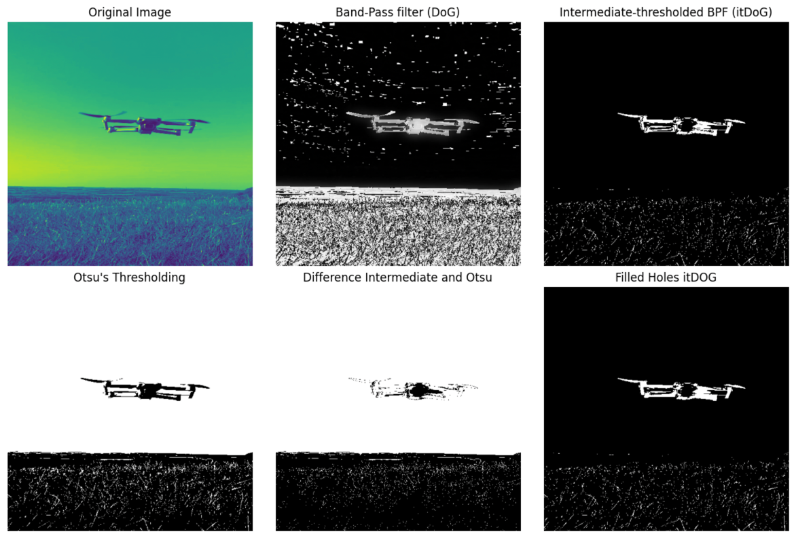
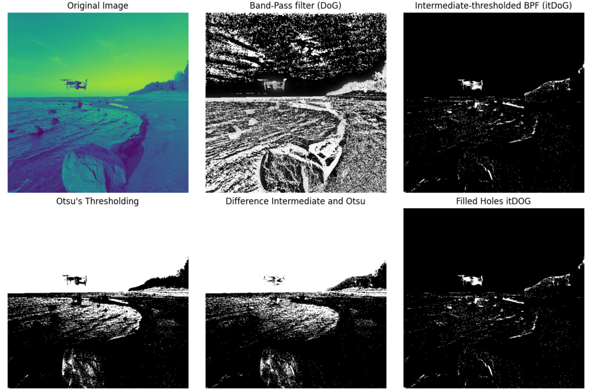

# Drone detection repo (experimental)

This repository contains code for DL object detection training and also detecting blobs in images using various computer vision techniques.

## Blob detection

My key insight was that drones are quite consistently spiny. their arms, blades, shape, often contains components between 5-20 pixels in size. So, a band-pass filter that keeps features in that range is likely to be useful.

The DoG was perfect for this. Then, the intermediate thresholding filter essentially says that anything black/white from the DoG is uninteresting - show me only the features that are in between (i.e. the spiny bits of the drone between 5-20pixels).

Then, fill the holes to make a contiguous region.

See some example below, using the blob_tracking.py code (apologies for the messy code, I was experimenting a lot). I used lo=50, hi=200, sigma1=0.2,sigma2=10. Feel free to experiment with these values.

example 1:

example 2:

